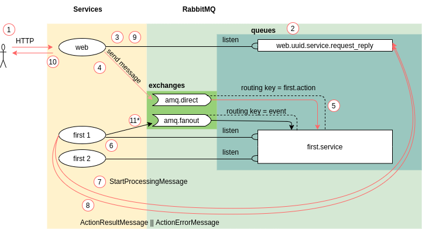

# Жизненный цикл запроса к сервису

## Вступление

При выполнении реальных задач, всегда будут возникать вопросы к
архитектуре для реализации той или иной функциональности. Для комфортной
разработки на Egal Server нужно понимать как он работает.

Текущая статья позволяет лучше понять внутренние процессы Egal Server.


## Обзор жизненного цикла



### Появление запроса

1. Запрос появляется на стороне клиента (Web Service, Egal Client и др.) [(1)](#Обзор-жизненного-цикла).

2. Web-service создает очередь для прослушивания ответов с названием в формате `web.{uuid}.service.request_reply` [(2)](#Обзор-жизненного-цикла)
и подписывается на получение сообщений этой очереди [(3)](#Обзор-жизненного-цикла).

3. Полученный http-запрос web-service преобразует в сообщение RabbitMQ, состоящее из тела запроса и ключа
маршрутизации. Данное сообщение публикуется в exchange `amq.direct` с ключом маршрутизации [(4)](#Обзор-жизненного-цикла).

Типы сообщений:
* Сообщение выполнения действия: `action`;
* Сообщение результата действия: `action_result`;
* Сообщение ошибки действия: `action_error`;
* Сообщения начала обработки сообщения выполнения действия: `start_processing`;
* Сообщение события: `event`;

Тело запроса предоставляется в виде `JSON` и содержит необходимую информацию для обращения к действию.

Вид тела запроса:

```json
{
    "type": "action", // Тип. Для запроса всегда `action`
    "service_name": "service", // Название сервиса
    "model_name": "Model", // Название модели
    "action_name": "doSomething", // Название действия
    "parameters": [], // Параметры действия
    "token": null, // UST
    "uuid": "457db8ed-c4de-466c-99c6-5665aa012cf9", // Уникальный идентификатор сообщения
    "hash": "04db8b86c8abbdd28e7cafa03b343ef9" // Hash тела сообщения
}
```

> UST описано в [документации](/server/authorization.md).

> Параметры действия соответствуют параметрам функции. Параметры
> стандартного CRUD описаны [здесь](/server/crud/index.md). Параметры
> уникальных действий запрашивайте у разработчиков.

Ключ маршрутизации сообщения:
* Для сообщений типа action: `{service}.action`;
* Для сообщений типа event: `event`;

### Обработка запроса

1. Каждый сервис поднимает свою очередь с названием в формате `{service}.service`,
привязанную к exchange `amq.direct` ключом маршрутизации `{service}.action` [(5)](#Обзор-жизненного-цикла),
и подписывается на получение сообщений данной очереди [(6)](#Обзор-жизненного-цикла). При поднятии нескольких копий
одного сервиса все они слушают одну очередь.

3. При получении сообщения выполнения действия (`action`) сервис отправляет в очередь типа `web.{uuid}.service.request_reply`
сообщение начала обработки сообщения выполнения действия (`start_processing`) [(7)](#Обзор-жизненного-цикла):
```json
{
   "type": "start_processing", // Тип. Для сообщения начала обработки всегда `start_processing`
   "started_at": 1638159617.485391, // Время начала обработки запроса
   "uuid": "084031c7-b12a-4942-a6b3-3f4cc850581a", // Уникальный идентификатор сообщения
   "action": {
      "type": "action",
      "service_name": "service",
       ...
      "uuid": "001fee89-d09c-4d5d-ae2a-bc855a74ecac"
   }
}  
```

4. Проверяется наличие модели и действия.
5. Проверяется доступ по следующим критериям: статус авторизации, роли,
   доступы.
6. Вызывается действие с указанными параметрами.
7. Формируется ответ:
   * В случае успешного вызова действия формируется сообщение результата
     выполнения действия (`action_result`):

   ```json
   {
       "type": "action_result",  // Тип. Для сообщения результата выполнения действия всегда `action_result`
       "data": {}, // Возвращенные данные действия
       "uuid": "af3c6b6b-ebf7-4192-bf37-49dc276510c8", // Уникальный идентификатор сообщения
       "action": {
       "type": "action",
       "service_name": "service",
        ...
       "uuid": "001fee89-d09c-4d5d-ae2a-bc855a74ecac"
       }
   }
   ```

   * В случае ошибки во время вызова действия формируется сообщение
     ошибки выполнения действия (`action_error`):

   ```json
   {
       "type": "action_error", // Тип. Для сообщения ошибки выполнения действия всегда `action_error`
       "code": 0, // Код ошибки
       "message": "actionGetIte не существует в модели App\\Models\\User!", // Код ошибки
       "uuid": "d4d70ef7-0076-4fa7-b116-22fea21adc30", // Уникальный идентификатор сообщения
       "action": {
       "type": "action",
       "service_name": "service",
        ...
       "uuid": "001fee89-d09c-4d5d-ae2a-bc855a74ecac"
       }
   }
   ```
8. Полученное сообщение результата/ошибки выполнения действия отправляется в очередь типа `web.{uuid}.service.request_reply` [(8)](#Обзор-жизненного-цикла).

### Получение ответа от сервиса

Web-service собирает все полученные на запрос сообщения [(9)](#Обзор-жизненного-цикла), 
формирует и отсылает ответ клиенту [(10)](#Обзор-жизненного-цикла).

### Отправка межсервисного события

Сообщения типа `event` сервисы отправляют в exchange `amq.fanout`, из которого сообщение рассылается во все
связанные с ним очереди по ключу маршрутизации `event` [(11)](#Обзор-жизненного-цикла).
