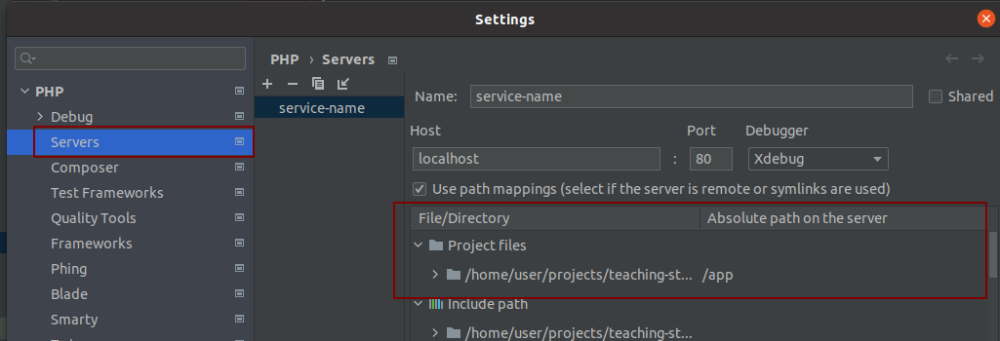
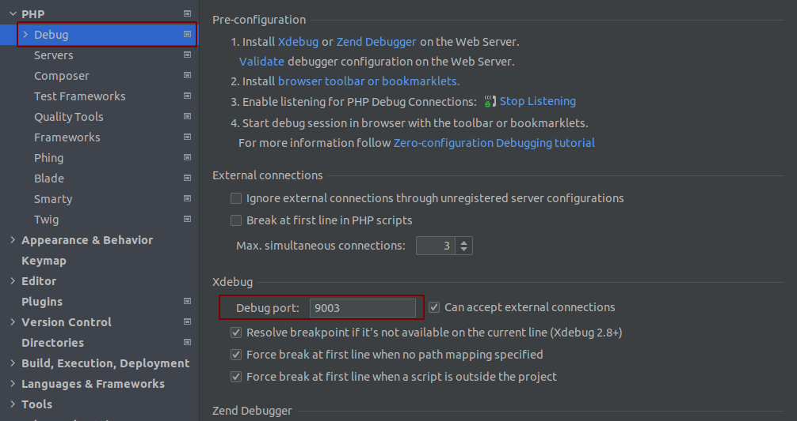
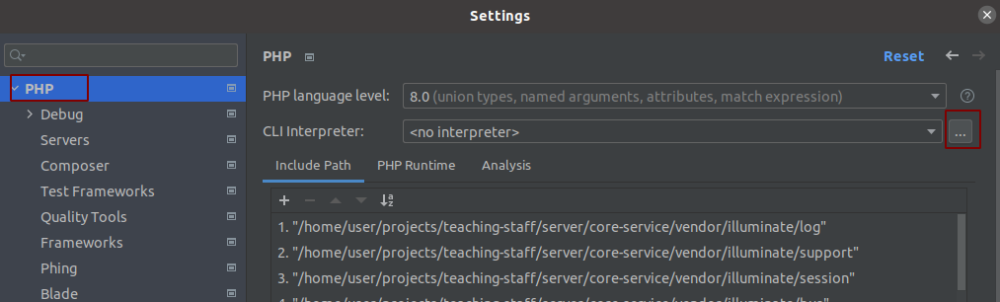
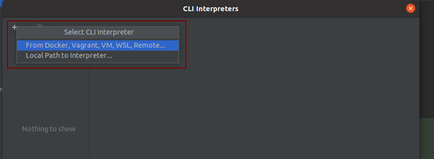
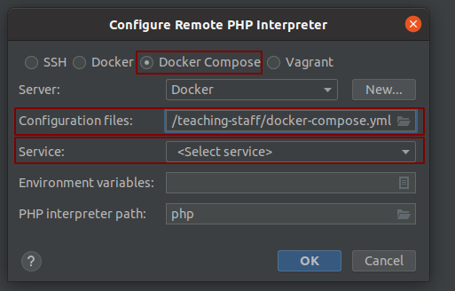
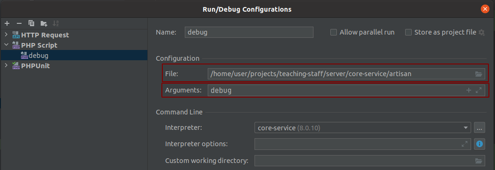

# Инструменты отладки

В данном разделе приводятся примеры использования всевозможных механизмов отладки работы микросервиса.

## Встроенные средства php

- var_dump()
- print_r()

## Средства Symfony

- dd()
- dump()

## Средства laravel

Laravel интегрирован с библиотекой [Monolog](https://github.com/Seldaek/monolog), 
которая обеспечивает поддержку множества мощных обработчиков логов.
Подробнее см. [Laravel Logging](https://laravel.com/docs/8.x/logging)

- Illuminate\Support\Facades\Log::info();
- Illuminate\Support\Facades\Log::debug();
- Illuminate\Support\Facades\Log::log();

## Отладка с помощью xDebug

С помощью расширения xDebug можно пошагово выполнять код, просматривая при этом содержание переменных. 
С этой и другими возможностями xDebug можно ознакомиться подробнее в [официальной документации](https://xdebug.org/docs/)

### Установка xDebug

В Dockerfile необходимо добавить установку xDebug и включение php-расширения:
```php
...

RUN pecl install xdebug \
&& docker-php-ext-enable xdebug

...
 
USER $user
```

### Конфигурирование xDebug в контейнерах
Необходимо добавить в контейнер следующие конфигурационны файлы:
```php
  service-name:
  environment:
      APP_SERVICE_NAME: service-name
      ...
      PHP_IDE_CONFIG: "serverName=service-name"
    volumes:
      - ./server/service-name:/app
      - ./server/xdebug/xdebug.ini:/usr/local/etc/php/conf.d/docker-php-ext-xdebug.ini
      - ./server/xdebug/error_reporting.ini:/usr/local/etc/php/conf.d/error_reporting.ini
```
Пример error_reporting.ini:
```php
error_reporting=E_ALL
```
Пример xdebug.ini:
```php
zend_extension=xdebug

[xdebug]
xdebug.mode=debug
xdebug.client_host=ip_address
xdebug.client_port=9003
xdebug.discover_client_host=0
xdebug.start_with_request=yes
```
### Конфигурирование xDebug в PHPSTORM
Требуется создать конфигурацию сервера отладки PHP и указать путь до проекта в контейнере:



Следующим шагом нужно указать порт для xDebug:



Из файла docker-compose.yml необходимо добавить CLI интерпретатор:





Если необходимо произвести отладку консольной команды, добавьте конфигурации, указав путь до команды и аргументы.
Пример конфигурации для команды artisan debug:



## Примеры использования:

### Логирование в файл

Для этой цели можно воспользоваться средствами laravel.
Этот механизм позволяет писать отладочную информацию в файл логов, находящийся в директории микросервиса
`storage/logs` с названием `lumen-****-**-**.log`.

Как пример можно рассмотреть логирование в действиях.

```php
<?php

namespace App\Models;
use Illuminate\Support\Facades\Log;
use Egal\Model\Model as EgalModel;

class Order extends EgalModel
{
    public static function actionUpdate($id = null, array $attributes = []): array
    {
        Log::info('id: ' . $id);
        Log::info('attributes: ' . print_r($attributes, true));
        // ...
    }
}
```

После выполнения запроса на обновление, вывод будет примерно такой:

```text
[2021-06-07 06:42:50] local.INFO: id: 53  
[2021-06-07 06:42:50] local.INFO: attributes: Array
(
    [name] => Ivanov
)
```

### В консольных командах

Порой бывает необходимость "быстро" проверить на работоспособность часть кода.
Для этого достаточно удобно создать отладочную команду и делать это там.

Рассмотрим пример работы такой команды. Создадим команду по такому пути `app/Console/Commands/DebugCommand.php`.

```php
<?php

namespace App\Console\Commands;

use Illuminate\Console\Command;
use Illuminate\Support\Facades\Log;

class DebugCommand extends Command
{

    protected $signature = 'debug';

    public function handle(): void
    {
        $country = new Country();
        $country->name = 'Russia';
        
        var_dump($country->name);
        print_r($country->name);
        dump($country->name);
        dd($country->name);
    }
}
```

Выполним команду для просмотра вывода
```shell
$ php artisan debug
Russia
string(6) "Russia"
^ "Russia"
^ "Russia"
```

### Отладка путем вывода информации в stdout демона.

Рассмотрим пример отладки работы `action` путем запуска слушателя в терминале.
Прописываем в `action` для отладки:

```php
// ...
public static function actionUpdate($id = null, array $attributes = []): array
{
        print_r('id: ' . $id);
        var_dump($attributes);
        // ...
}
// ...
```

Запускаем слушателя
```shell
docker-compose exec order-service ./artisan egal:listener:run
```

Теперь вся отладочная информация будет выводиться в терминале.
