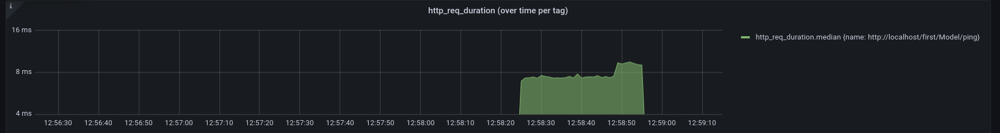
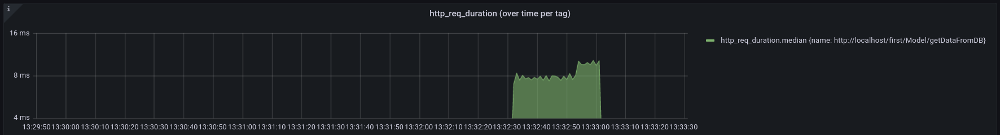
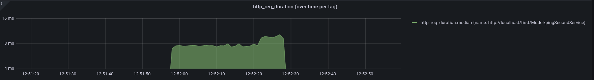
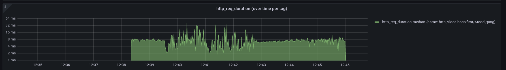
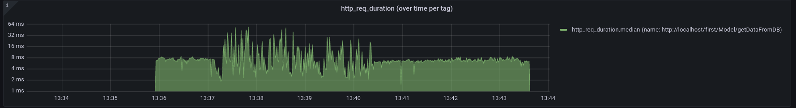
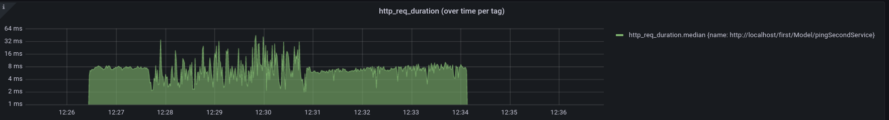

# Производительность

В данном разделе приведены результаты оценки производительности Egal под нагрузкой
с использованием инструментов Siege и k6 для моделирования нагрузки.

---

**Характеристики используемой машины**
* Процессор: Intel(R) Core(TM) i7-8565U CPU @ 1.80GHz
* Оперативная память: 16G

---

**Тестируемый проект**
* web-service: 
  * Количество: 1
  * image: egalbox/web-service:v2.1.0
* first-service:
  * Количество: 1
  * Версия egal/framework: v2.1.0
* second-service:
    * Количество: 1
    * Версия egal/framework: v2.1.0
* postgres:
    * Количество: 1
  * image: egalbox/postgres:v2.1.0
---

**Тестируемые запросы**
1. Простой ping. Сервис `first` в ответ на запрос возвращает строку pong (URL: `http://localhost/first/Model/ping`).

2. Обращение к БД. Сервис `first` в ответ на запрос обращается к БД на получение 10 записей, содержащих id (URL: `http://localhost/first/Model/getDataFromDB`).

3. Ping другого сервиса. Сервис `first` в ответ на запрос обращается к сервису `second`, получая в ответ строку pong (URL: `http://localhost/first/Model/pingSecondService`).

---
**Описание тестов**

|  №  | Продолжительность тестирования | Кол-во виртуальных пользователей  | Задержка между запросами |                       URL                        |                       Ссылка на документацию k6                       |
|:---:|:------------------------------:|:---------------------------------:|:------------------------:|:------------------------------------------------:|:---------------------------------------------------------------------:|
|  1  |              30s               |                25                 |            0s            |       `http://localhost/first/Model/ping`        |                                   -                                   |
|  2  |              30s               |                25                 |            0s            |   `http://localhost/first/Model/getDataFromDB`   |                                   -                                   |
|  3  |              30s               |                25                 |            0s            | `http://localhost/first/Model/pingSecondService` |                                   -                                   |
|  4  | 10s, 1m, 10s, 3m, 10s, 3m, 10s | 100, 100, 1400, 1400, 100, 100, 0 |            1s            |       `http://localhost/first/Model/ping`        |  [link](https://k6.io/docs/test-types/stress-testing/#spike-testing)  |
|  5  | 10s, 1m, 10s, 3m, 10s, 3m, 10s | 100, 100, 1400, 1400, 100, 100, 0 |            1s            |   `http://localhost/first/Model/getDataFromDB`   | [link]((https://k6.io/docs/test-types/stress-testing/#spike-testing)) |
|  6  | 10s, 1m, 10s, 3m, 10s, 3m, 10s | 100, 100, 1400, 1400, 100, 100, 0 |            1s            | `http://localhost/first/Model/pingSecondService` | [link]((https://k6.io/docs/test-types/stress-testing/#spike-testing)) |

---
**Результаты**
<!-- tabs:start -->

#### ** Тест №1 **

Результат запуска скрипта с k6 (2931 t/s)

```
running (0m30.0s), 00/25 VUs, 87972 complete and 0 interrupted iterations
default ✓ [======================================] 25 VUs  30s

     data_received..................: 43 MB  1.4 MB/s
     data_sent......................: 8.0 MB 267 kB/s
     http_req_blocked...............: avg=2.78µs  min=811ns   med=2.01µs  max=3.34ms   p(90)=2.87µs  p(95)=3.61µs 
     http_req_connecting............: avg=118ns   min=0s      med=0s      max=894.25µs p(90)=0s      p(95)=0s     
     http_req_duration..............: avg=8.44ms  min=1.74ms  med=7.58ms  max=42.51ms  p(90)=12.04ms p(95)=14.5ms 
       { expected_response:true }...: avg=8.44ms  min=1.74ms  med=7.58ms  max=42.51ms  p(90)=12.04ms p(95)=14.5ms 
     http_req_failed................: 0.00%  ✓ 0           ✗ 87972
     http_req_receiving.............: avg=41.64µs min=12.28µs med=32.71µs max=12.59ms  p(90)=53.2µs  p(95)=68.47µs
     http_req_sending...............: avg=12.52µs min=4.29µs  med=9.36µs  max=8.93ms   p(90)=14.02µs p(95)=19.25µs
     http_req_tls_handshaking.......: avg=0s      min=0s      med=0s      max=0s       p(90)=0s      p(95)=0s     
     http_req_waiting...............: avg=8.39ms  min=1.7ms   med=7.53ms  max=42.46ms  p(90)=11.97ms p(95)=14.42ms
     http_reqs......................: 87972  2931.139247/s
     iteration_duration.............: avg=8.51ms  min=1.78ms  med=7.65ms  max=42.82ms  p(90)=12.12ms p(95)=14.59ms
     iterations.....................: 87972  2931.139247/s
     vus............................: 25     min=25        max=25 
     vus_max........................: 25     min=25        max=25 
```

График



#### ** Тест №2 **


Результат запуска скрипта с k6 (2702 t/s)

```
running (0m30.0s), 00/25 VUs, 81116 complete and 0 interrupted iterations
default ✓ [======================================] 25 VUs  30s

     data_received..............: 49 MB   1.6 MB/s
     data_sent..................: 8.1 MB  270 kB/s
     http_req_blocked...........: avg=2.92µs  min=863ns   med=2.13µs  max=3.61ms   p(90)=3.08µs  p(95)=3.81µs 
     http_req_connecting........: avg=125ns   min=0s      med=0s      max=809.09µs p(90)=0s      p(95)=0s     
     http_req_duration..........: avg=9.16ms  min=1.34ms  med=8.12ms  max=55.23ms  p(90)=13.73ms p(95)=16.35ms
     http_req_failed............: 100.00% ✓ 81116       ✗ 0   
     http_req_receiving.........: avg=44.47µs min=13.11µs med=34.06µs max=14.54ms  p(90)=56.87µs p(95)=72.49µs
     http_req_sending...........: avg=13.7µs  min=4.62µs  med=9.83µs  max=15.43ms  p(90)=15.29µs p(95)=20.69µs
     http_req_tls_handshaking...: avg=0s      min=0s      med=0s      max=0s       p(90)=0s      p(95)=0s     
     http_req_waiting...........: avg=9.1ms   min=1.3ms   med=8.06ms  max=55.07ms  p(90)=13.66ms p(95)=16.27ms
     http_reqs..................: 81116   2702.886899/s
     iteration_duration.........: avg=9.23ms  min=1.39ms  med=8.19ms  max=55.99ms  p(90)=13.82ms p(95)=16.44ms
     iterations.................: 81116   2702.886899/s
     vus........................: 25      min=25        max=25
     vus_max....................: 25      min=25        max=25
```
График



#### ** Тест №3 **

Результат запуска скрипта с k6 (2567 t/s)

```
running (0m30.0s), 00/25 VUs, 83888 complete and 0 interrupted iterations
default ✓ [======================================] 25 VUs  30s

     data_received..............: 51 MB   1.7 MB/s
     data_sent..................: 8.7 MB  291 kB/s
     http_req_blocked...........: avg=3.01µs  min=778ns   med=2.04µs  max=7.29ms   p(90)=2.93µs  p(95)=3.7µs  
     http_req_connecting........: avg=163ns   min=0s      med=0s      max=949.61µs p(90)=0s      p(95)=0s     
     http_req_duration..........: avg=8.85ms  min=1.49ms  med=7.86ms  max=69.51ms  p(90)=13.2ms  p(95)=15.8ms 
     http_req_failed............: 100.00% ✓ 83888       ✗ 0   
     http_req_receiving.........: avg=45.51µs min=12.42µs med=33.19µs max=12.51ms  p(90)=54.18µs p(95)=69.58µs
     http_req_sending...........: avg=13.43µs min=4.22µs  med=9.56µs  max=9.05ms   p(90)=14.54µs p(95)=20.02µs
     http_req_tls_handshaking...: avg=0s      min=0s      med=0s      max=0s       p(90)=0s      p(95)=0s     
     http_req_waiting...........: avg=8.79ms  min=1.45ms  med=7.81ms  max=69.43ms  p(90)=13.13ms p(95)=15.7ms 
     http_reqs..................: 83888   2795.262938/s
     iteration_duration.........: avg=8.93ms  min=1.54ms  med=7.93ms  max=69.58ms  p(90)=13.3ms  p(95)=15.9ms 
     iterations.................: 83888   2795.262938/s
     vus........................: 25      min=25        max=25
     vus_max....................: 25      min=25        max=25
```
График



#### ** Тест №4 **

Результат запуска скрипта с k6 (626 t/s)

```
running (7m40.7s), 0000/1400 VUs, 288879 complete and 0 interrupted iterations
default ✓ [======================================] 0000/1400 VUs  7m40s

     data_received..................: 140 MB 304 kB/s
     data_sent......................: 26 MB  57 kB/s
     http_req_blocked...............: avg=8.34µs  min=1.05µs   med=3.45µs  max=29.29ms  p(90)=10.56µs  p(95)=11.98µs 
     http_req_connecting............: avg=2.03µs  min=0s       med=0s      max=29.15ms  p(90)=0s       p(95)=0s      
   ✓ http_req_duration..............: avg=12.87ms min=823.12µs med=6.24ms  max=155.31ms p(90)=36.07ms  p(95)=50.59ms 
       { expected_response:true }...: avg=12.87ms min=823.12µs med=6.24ms  max=155.31ms p(90)=36.07ms  p(95)=50.59ms 
     http_req_failed................: 0.00%  ✓ 0          ✗ 288879
     http_req_receiving.............: avg=64.33µs min=11.28µs  med=37.72µs max=22.07ms  p(90)=132.73µs p(95)=162.41µs
     http_req_sending...............: avg=27.32µs min=4.17µs   med=13.24µs max=25.04ms  p(90)=50.05µs  p(95)=63.87µs 
     http_req_tls_handshaking.......: avg=0s      min=0s       med=0s      max=0s       p(90)=0s       p(95)=0s      
     http_req_waiting...............: avg=12.78ms min=789.27µs med=6.09ms  max=155.24ms p(90)=35.96ms  p(95)=50.49ms 
     http_reqs......................: 288879 626.993521/s
     iteration_duration.............: avg=1.01s   min=1s       med=1s      max=1.15s    p(90)=1.03s    p(95)=1.05s   
     iterations.....................: 288879 626.993521/s
     vus............................: 7      min=7        max=1400
     vus_max........................: 1400   min=1400     max=1400
```
График



#### ** Тест №5 **

Результат запуска скрипта с k6 (625 t/s)

```
running (7m40.6s), 0000/1400 VUs, 288173 complete and 0 interrupted iterations
default ✓ [======================================] 0000/1400 VUs  7m40s

     data_received..............: 173 MB  375 kB/s
     data_sent..................: 29 MB   63 kB/s
     http_req_blocked...........: avg=8.85µs  min=1.07µs   med=3.47µs  max=35.05ms  p(90)=10.58µs  p(95)=11.98µs 
     http_req_connecting........: avg=2.45µs  min=0s       med=0s      max=34.94ms  p(90)=0s       p(95)=0s      
   ✓ http_req_duration..........: avg=15.18ms min=852.05µs med=6.63ms  max=183.86ms p(90)=42.86ms  p(95)=57.7ms  
     http_req_failed............: 100.00% ✓ 288173     ✗ 0     
     http_req_receiving.........: avg=65.46µs min=10.59µs  med=38.35µs max=14.1ms   p(90)=134.64µs p(95)=166.09µs
     http_req_sending...........: avg=27.91µs min=4.53µs   med=13.29µs max=35.53ms  p(90)=50.71µs  p(95)=64.68µs 
     http_req_tls_handshaking...: avg=0s      min=0s       med=0s      max=0s       p(90)=0s       p(95)=0s      
     http_req_waiting...........: avg=15.09ms min=817.84µs med=6.48ms  max=183.81ms p(90)=42.77ms  p(95)=57.59ms 
     http_reqs..................: 288173  625.654321/s
     iteration_duration.........: avg=1.01s   min=1s       med=1s      max=1.18s    p(90)=1.04s    p(95)=1.05s   
     iterations.................: 288173  625.654321/s
     vus........................: 5       min=5        max=1400
     vus_max....................: 1400    min=1400     max=1400
```
График



#### ** Тест №6 **

Результат запуска скрипта с k6 (626 t/s)

```
running (7m40.9s), 0000/1400 VUs, 288656 complete and 0 interrupted iterations
default ✓ [======================================] 0000/1400 VUs  7m40s

     data_received..............: 176 MB  381 kB/s
     data_sent..................: 30 MB   65 kB/s
     http_req_blocked...........: avg=8.42µs  min=970ns    med=3.32µs  max=29.01ms  p(90)=10.55µs  p(95)=11.91µs 
     http_req_connecting........: avg=2.19µs  min=0s       med=0s      max=28.85ms  p(90)=0s       p(95)=0s      
   ✓ http_req_duration..........: avg=13.22ms min=806.47µs med=6.51ms  max=154.97ms p(90)=35.18ms  p(95)=51.67ms 
     http_req_failed............: 100.00% ✓ 288656     ✗ 0     
     http_req_receiving.........: avg=63.4µs  min=10.35µs  med=36.92µs max=33.22ms  p(90)=134.51µs p(95)=163.64µs
     http_req_sending...........: avg=27.21µs min=4.59µs   med=12.67µs max=23.51ms  p(90)=51.16µs  p(95)=64.65µs 
     http_req_tls_handshaking...: avg=0s      min=0s       med=0s      max=0s       p(90)=0s       p(95)=0s      
     http_req_waiting...........: avg=13.13ms min=780.09µs med=6.36ms  max=154.91ms p(90)=35.09ms  p(95)=51.58ms 
     http_reqs..................: 288656  626.234355/s
     iteration_duration.........: avg=1.01s   min=1s       med=1s      max=1.15s    p(90)=1.03s    p(95)=1.05s   
     iterations.................: 288656  626.234355/s
     vus........................: 6       min=6        max=1400
     vus_max....................: 1400    min=1400     max=1400
```
График



<!-- tabs:end -->